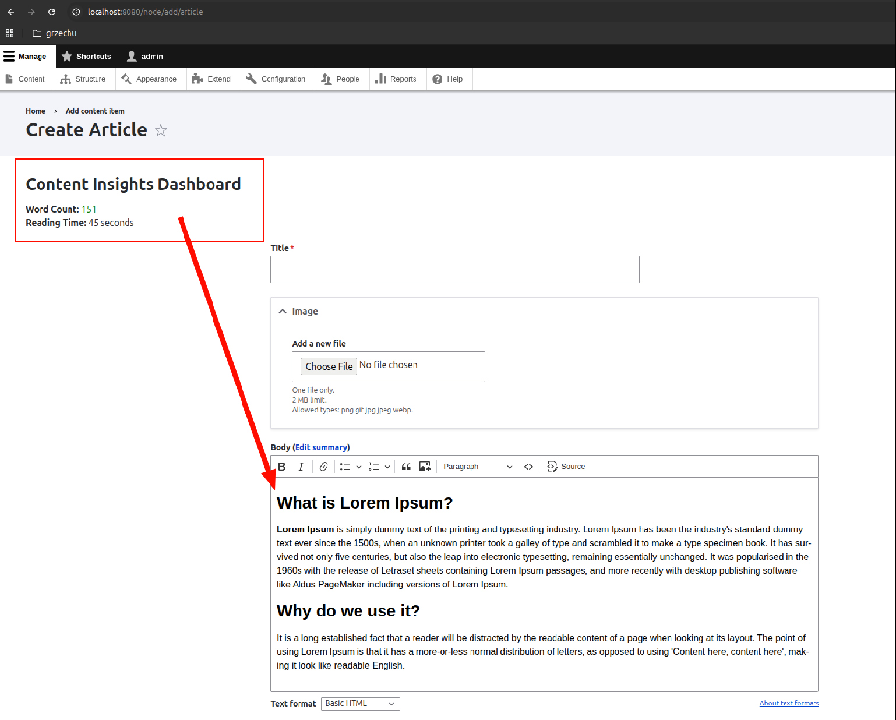
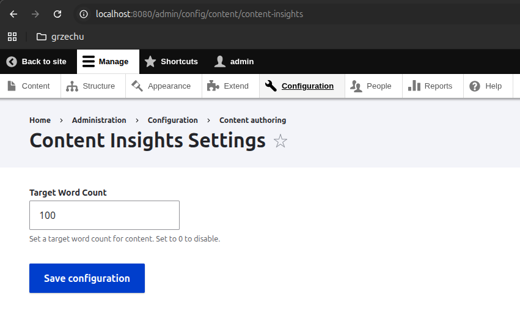

<h1 align="center">Content Insights Module</h1>

<p align="center">
    <strong>Module provides content editors with useful, real-time feedback on the content they are writing, directly on the node edit form.</strong> The project was created solely for the purpose of presenting my skills.
</p>

<p align="center">
    =8.4-blue?colorB=%238892BF" alt="Code Coverage">  
    
    
</p>

# Table of Contents
- [Run demo with Docker](#run-demo-with-Docker)
- [Requirements](#requirements)
- [Installation](#installation)
- [Configuration](#configuration)
- [Development with Docker](#development-with-docker)


## Run demo with Docker
1.  Clone this repository, navigate to its root directory and run:

    ```shell
    docker compose up -d
    ```

2.  Visit http://localhost:8080/user/login and login using demo credentials:

    **username:** admin  
    **password:** admin

3.  Visit: http://localhost:8080/node/add/article and try to write something in `Body` text editor.



---

## Requirements

*   Drupal 11
*   PHP 8.4 or higher

---

## Installation

1.  **Add repository to your composer.json Drupal project**

    Add the following repository to your `composer.json` file:

    ```
      "repositories": [
        {
          "type": "vcs",
          "url": "https://github.com/grzegorz-jamroz/drupal-content-insights-module"
        }
      ],
    ```

2.  **Install module running following command:**

    ```bash
    composer require grzegorz-jamroz/drupal-content-insights-module
    ```

3.  **Enable the Module**

    **Method A** - using Drush (Recommended)
    ```bash
    # If using DDEV
    ddev drush en content_insights -y

    # Or if using a standalone Drush
    drush en content_insights -y
    ```

    **Method B** - using the Drupal UI

    *   Log in to your Drupal site as an administrator.
    *   Navigate to the "Extend" page (`/admin/modules`).
    *   Find "Content Insights" in the list and check the box.
    *   Scroll to the bottom and click "Install".

---

## Configuration

After enabling the module, navigate to the configuration page at `Configuration > Content authoring > Content Insights Settings` (`/admin/config/content/content-insights`) to customize the settings according to your preferences.



---

# Development with Docker

### Build and run the containers:
```shell
docker compose up -d
```

### Clear cache

```shell
docker compose exec app drush cr
```

### Copy vendor and composer.lock from container to host

```shell
docker compose cp app:/var/www/html/vendor ./vendor
```

### Enable xdebug

```shell
docker compose exec app xdebug on
```

### Disable xdebug

```shell
docker compose exec app xdebug off
```
